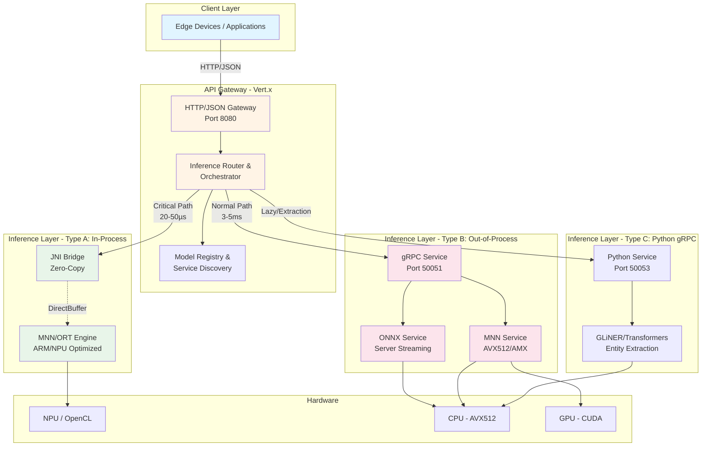
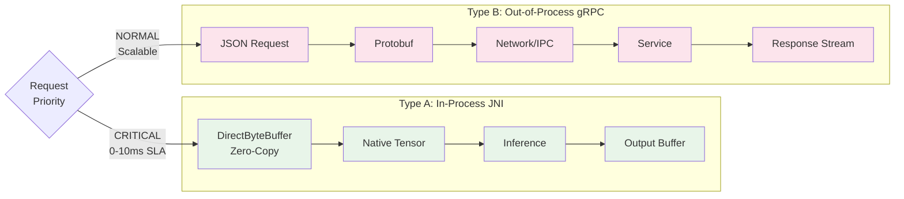
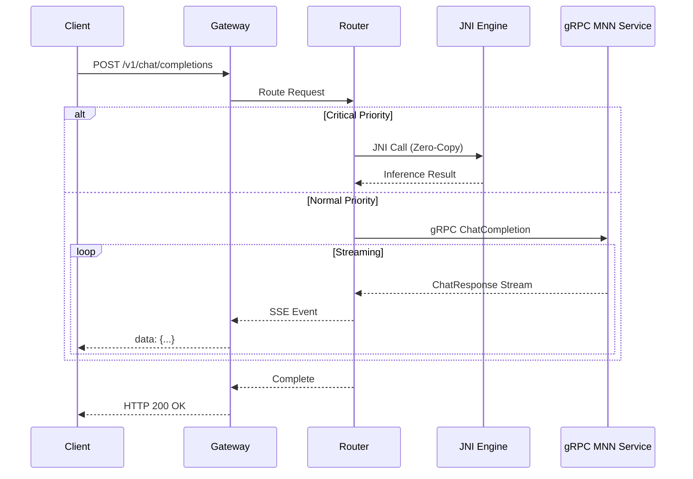
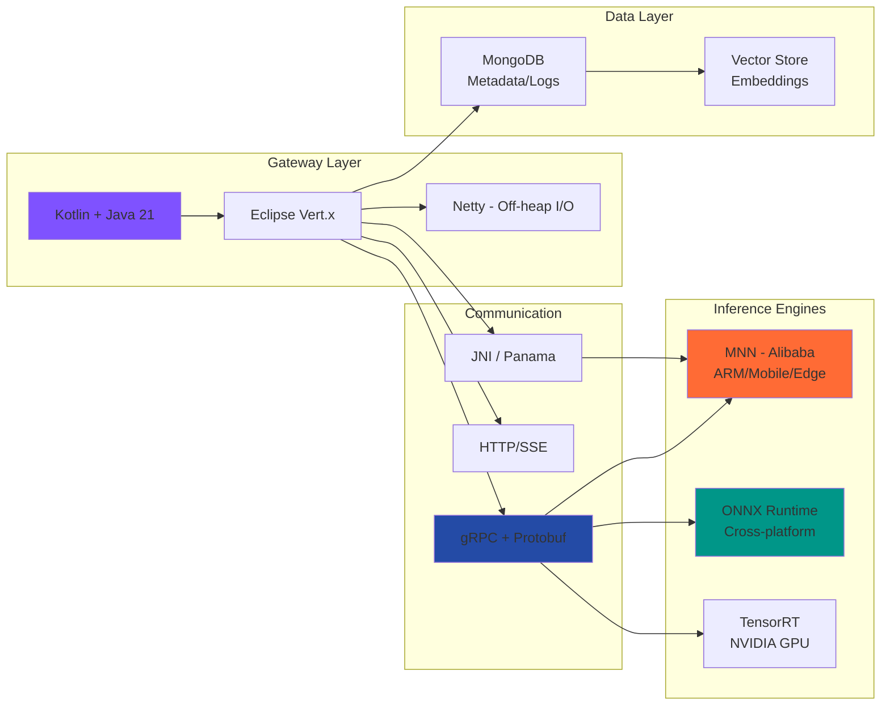
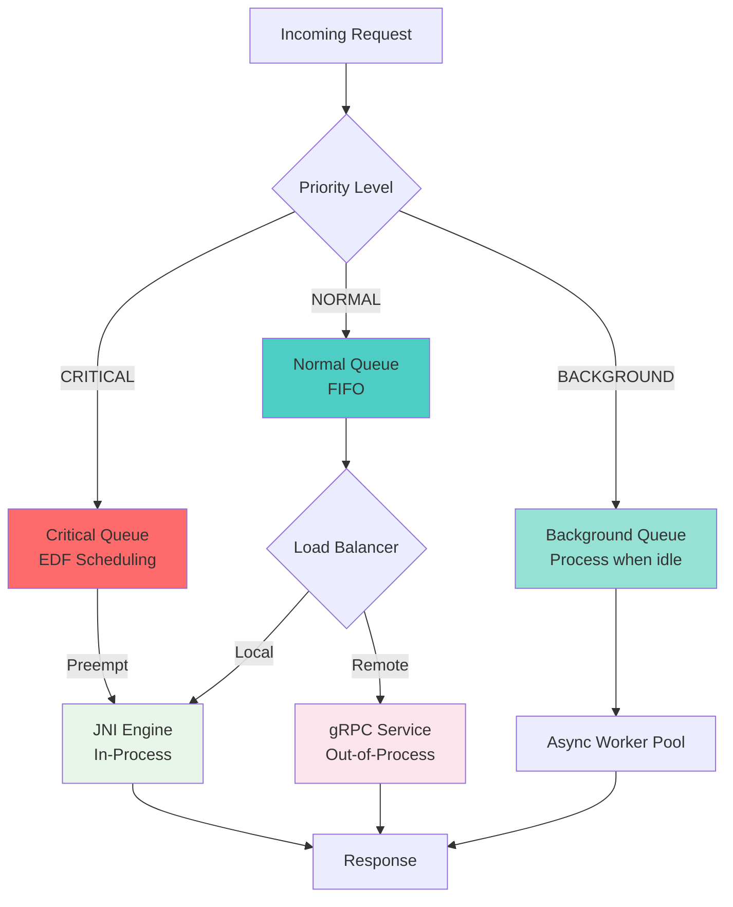

# FogAI


**High-performance, distributed fog/edge-first AI inference platform** with OpenAI-compatible API. Leverages heterogeneous multi-engine backends (MNN, ONNX Runtime) for efficient AI inference across diverse hardware architectures.

## Vision

FogAI is designed for intelligent edge and fog computing scenarios where low latency, energy efficiency, and optimization for edge hardware are critical. The platform is particularly well-suited for Decision Support Agents (DSA) and real-time data stream processing.

### Key Features

- **OpenAI-Compatible API** - Drop-in replacement for OpenAI endpoints
- **Ultra-Low Latency** - JNI-based in-process inference with less than 50µs overhead
- **Dual-Mode Architecture** - In-process (JNI) and distributed (gRPC) inference
- **Multi-Engine Support** - MNN (ARM/Edge), ONNX Runtime (Universal)
- **Priority-Based Scheduling** - Real-time request prioritization for critical workloads
- **Zero-Copy Pipeline** - Efficient memory management for edge devices
- **Hardware Optimized** - ARM64, x86_64, NPU, GPU support
- **Knowledge Extraction (GLiNER)** - Support for lightweight, zero-shot entity recognition to build Knowledge Graphs directly at the edge, avoiding general LLM hallucinations.



## System Architecture

### Benchmarks & Real-World Performance

FogAi relies heavily on pushing deterministic smaller models (like GLiNER for Named Entity Recognition) to the edge to avoid the "Inference Tax" of network serialization protocols and Python GIL bottlenecks.

Measured on an **ARM64 Edge Node (e.g., Orange Pi 5 / RK3588, 8GB RAM)** processing GLiNER (`gliner-bi-v2`):
- **Type A (In-Process JNI)**: ~750 ms end-to-end latency. The direct off-heap C++ memory handoff bypasses networking/serialization. Pure JNI call overhead remains strictly under **20-50µs**.
- **Type B (Out-of-Process C++ gRPC)**: ~1,250 ms - 2,100 ms under load. Safe and isolated architecture, but Protobuf serialization and HTTP/2 IPC create a measurable overhead bottleneck.
- **Type C (Out-of-Process Python gRPC)**: ~3,200 ms - 4,500 ms under load. Used strictly for prototyping.

### Precision & Hallucination Handling
Unlike general-purpose Generative LLMs that can hallucinate facts or refuse instructions, utilizing **GLiNER (Bi-Encoder Architecture)** guarantees deterministic Named Entity Recognition based on requested labels. It provides exact start/end character indices and confidence scores, making it mathematically impossible to "hallucinate" entities not present in the source text.

### Hardware Footprint & Power Consumption
In a typical edge deployment (e.g., Rockchip 3588), the entire Gateway + JNI MNN engine stack consumes approximately:
- **Idle Power**: ~2-3 Watts
- **Active Inference Peak**: ~5-8 Watts
- **RAM Footprint**: Vert.x Gateway (~256MB) + Cached Models (e.g., GLiNER takes <400MB native RAM).

## Dual Inference Strategy

FogAI implements two complementary inference modes:



| Mode | Latency | Use Case | Coupling |
|------|---------|----------|----------|
| **Type A (JNI)** | 20-50µs | Critical DSA, Sensor Fusion | Tight (in-process) |
| **Type B (gRPC)** | 3-5ms | Heavy LLMs, Multi-host | Loose (isolated) |

**JNI Stability & Error Handling:** To prevent native C++ segmentation faults from crashing the JVM Gateway, the JNI bridge (`libmnn_bridge.so`) implements strict bound checks, `try/catch` exception boundaries in C++, and manual memory management for direct byte buffers. Any unrecoverable model errors are passed back to Java safely to emit an HTTP 500 error cleanly rather than aborting the JVM process.

## Request Flow



## Quick Start

### Prerequisites

- **Gateway**: Java 21+, Gradle 8.x
- **MNN Service**: CMake 3.20+, Conan 2.x, C++17 compiler
- **ONNX Service**: CMake 3.20+, Python 3.8+ (optional)
- **Models**: Download models to `models/` directory

### Edge Hardware Quick-Start (e.g., Raspberry Pi 5 / Orange Pi)
If you are deploying directly to an ARM edge device without Docker:
1. Ensure `openjdk-21-jdk`, `cmake`, and standard build tools are installed.
2. Build the JNI bridge `libmnn_bridge.so` natively (see step 2 below) and copy it to `gateway/libs/`.
3. Set `LD_LIBRARY_PATH=$(pwd)/gateway/libs` before running `./gradlew run` to ensure the Gateway finds the native engine.

### Build & Run

#### 1. Build Gateway

```bash
cd gateway
./gradlew build
./gradlew run
```

Gateway will start on `http://localhost:8080`

#### 2. Build MNN Inference Service

```bash
cd inference-services/mnn-service
conan install . --build=missing --settings=build_type=Release
cmake -B build -DCMAKE_BUILD_TYPE=Release -DCMAKE_TOOLCHAIN_FILE=conan_toolchain.cmake
cmake --build build --config Release
./build/mnn-service
```

MNN service will start on `0.0.0.0:50051`

#### 3. Configure Services

Edit `gateway/nodes.json` to register inference nodes:

```json
{
  "nodes": [
    {
      "id": "local-mnn",
      "type": "mnn-jni",
      "prefix": "native-"
    },
    {
      "id": "remote-mnn",
      "type": "grpc",
      "host": "localhost",
      "port": 50051,
      "prefix": "mnngrpc"
    },
    {
      "id": "onnx-service",
      "type": "grpc",
      "host": "localhost",
      "port": 50052,
      "prefix": "onnx-"
    },
    {
      "id": "type-c-python-node",
      "type": "grpc",
      "host": "localhost",
      "port": 50053,
      "prefix": "py-onnx-"
    }
  ]
}
```

### Test the System

```bash
# List available models
curl http://localhost:8080/v1/models

# Chat completion (streaming)
curl -X POST http://localhost:8080/v1/chat/completions \
  -H "Content-Type: application/json" \
  -d '{
    "model": "mnngrpcqwen2-0.5b",
    "messages": [{"role": "user", "content": "Hello!"}],
    "stream": true,
    "max_tokens": 50
  }'

# Generate embeddings
curl -X POST http://localhost:8080/v1/embeddings \
  -H "Content-Type: application/json" \
  -d '{
    "model": "native-Qwen3-Embedding-0.6B-MNN",
    "input": "Your text here"
  }'
```

### Run Integration Tests

```bash
cd testsuite
chmod +x test_integration.sh stress_test.sh
./test_integration.sh
```

### Launch Web UI

FogAI provides a pre-configured `docker-compose` environment featuring two popular chat interfaces: **Open WebUI** and **Lobe Chat**. These are configured out-of-the-box to interface with the FogAI Gateway.

1. Ensure Docker and Docker Compose are installed.
2. Navigate to the `UI` directory and start the services:

```bash
cd UI
docker-compose up -d
```

3. Access the interfaces via your browser:
   - **Open WebUI**: `http://localhost:3000`
   - **Lobe Chat**: `http://localhost:3210` (Password: `fogai`)

The UIs will automatically connect to the Gateway at `http://host.docker.internal:8080/v1` and discover your models.

## API Reference

FogAI implements OpenAI-compatible endpoints:

### Endpoints

| Method | Endpoint | Description | Status |
|--------|----------|-------------|--------|
| `GET` | `/v1/models` | List available models | ✅ |
| `POST` | `/v1/chat/completions` | Chat completions (streaming & non-streaming) | ✅ |
| `POST` | `/v1/embeddings` | Generate vector embeddings | ✅ |

### Example: Chat Completion

**Request:**
```json
{
  "model": "mnngrpcqwen2-0.5b",
  "messages": [
    {"role": "system", "content": "You are a helpful assistant."},
    {"role": "user", "content": "Explain quantum computing"}
  ],
  "temperature": 0.7,
  "max_tokens": 100,
  "stream": true
}
```

**Response (SSE Stream):**
```
data: {"id":"chatcmpl-123","choices":[{"index":0,"delta":{"content":"Quantum"},"finish_reason":null}]}

data: {"id":"chatcmpl-123","choices":[{"index":0,"delta":{"content":" computing"},"finish_reason":null}]}

data: [DONE]
```

## Technology Stack



### Components

- **Backend**: Kotlin + Java 21 (Vert.x) with non-blocking I/O
- **Inference Engines**:
  - **MNN** (Alibaba) - Primary for ARM/Mobile/Edge (CPU/NPU/OpenCL)
  - **ONNX Runtime** - Universal cross-platform support
  - **TensorRT** - High-throughput GPU inference (planned)
- **Interoperability**: JNI / Project Panama for native access
- **Protocol**: gRPC (internal), HTTP/SSE (external)
- **Database**: MongoDB for metadata, logs, vector storage

## Project Structure

```
FogAI/
├── gateway/                  # Vert.x API Gateway (Kotlin)
│   ├── src/main/kotlin/
│   │   └── com/tactorder/
│   │       ├── api/          # HTTP Handlers
│   │       ├── domain/       # Core Business Logic
│   │       ├── application/  # Use Cases
│   │       └── infrastructure/ # gRPC Clients, JNI
│   ├── build.gradle.kts
│   └── nodes.json            # Service Registry
│
├── inference-services/
│   ├── mnn-service/          # MNN gRPC Service (C++)
│   │   ├── src/
│   │   ├── MNN/              # Git Submodule
│   │   └── CMakeLists.txt
│   │
│   ├── onnx-service/         # ONNX gRPC Service (C++)
│   │   ├── src/
│   │   └── CMakeLists.txt
│   │
│   └── common/               # Shared protobuf definitions
│
├── proto/
│   └── inference.proto       # gRPC Service Definition
│
├── doc/                      # Comprehensive Documentation
│   ├── architecture.md       # System Architecture
│   ├── api-gateway.md        # Gateway Implementation
│   ├── inference-interface.md # Dual Interface Strategy
│   └── mnn-engine.md         # MNN Service Details
│
├── models/                   # Model Storage (gitignored)
├── scripts/                  # Utility Scripts (download_models.sh)
└── testsuite/                # Integration Test Suite and Payload Generators
    ├── test_integration.sh
    └── stress_test.sh
```

## Priority-Based Routing

FogAI implements intelligent request prioritization:



| Priority | Use Case | Latency Target | Execution Mode |
|----------|----------|----------------|----------------|
| **CRITICAL** | DSA, Sensor Fusion | 0-10ms | JNI (Preemptive) |
| **NORMAL** | User Chat, Completions | 10-100ms | Load Balanced |
| **BACKGROUND** | Analytics, Batch Jobs | Best Effort | Queued |

## Model Management

### Automatic Model Discovery

The Gateway automatically discovers models:

1. **Local Models** (`MNN_MODELS_DIR`): Scanned and prefixed with `native-`
2. **Remote Models**: Queried via gRPC `ListModels` and prefixed (e.g., `mnngrpc`, `py-onnx-`)
3. **Heartbeat Loop**: The Gateway runs a 10s polling interval (`isHealthy()`) against all nodes. Offline nodes are actively evicted from `/v1/models` in real time, and restored upon recovery.

### Routing Strategy

1. **Exact Match**: Routes to service with registered model ID
2. **Prefix Match**: Matches dynamic IDs (e.g., `mnngrpc*` → gRPC service)
3. **Strict Fallback**: If a requested model does not match an *Active* node (passed the Heartbeat), the Gateway safely throws `404 Not Found` rather than forcing JNI engine failures.

## Development

### Running Tests

```bash
# Gateway unit tests
cd gateway
./gradlew test

# Integration tests
./test_integration.sh
```

### Debug Mode

```bash
# Gateway with debug logging
cd gateway
VERTX_LOGGER_DELEGATE_FACTORY_CLASS_NAME=io.vertx.core.logging.SLF4JLogDelegateFactory \
./gradlew run

# MNN Service with verbose logging
cd inference-services/mnn-service
./build/mnn-service --verbose
```

## Roadmap

- [x] OpenAI-compatible API Gateway
- [x] gRPC MNN Inference Service
- [x] ONNX Runtime Service
- [x] Model Discovery & Registry
- [x] Streaming Chat Completions
- [x] Embeddings Support
- [ ] JNI/Panama Native Bridge (Type A)
- [x] DSA Logic: Implement the Priority Queue and Preemption logic in Vert.x.
- [ ] TensorRT GPU Support
- [ ] Model Caching & Warm-up
- [ ] Request Batching
- [ ] Distributed Tracing
- [ ] Prometheus Metrics

## Documentation

- [Architecture Overview](doc/architecture.md) - System design and vision
- [API Gateway](doc/api-gateway.md) - Gateway implementation details
- [Inference Interface](doc/inference-interface.md) - JNI vs gRPC strategies
- [MNN Engine](doc/mnn-engine.md) - MNN service implementation

## Contributing

Contributions are welcome! Please see [CONTRIBUTING.md](CONTRIBUTING.md) for guidelines.

### Development Workflow

1. Fork the repository
2. Create a feature branch (`git checkout -b feature/amazing-feature`)
3. Commit your changes (`git commit -m 'Add amazing feature'`)
4. Push to the branch (`git push origin feature/amazing-feature`)
5. Open a Pull Request

## License

This project is licensed under the Apache License 2.0 - see the [LICENSE](LICENSE) file for details.

## Acknowledgments

- [Alibaba MNN](https://github.com/alibaba/MNN) - High-performance neural network inference framework
- [Eclipse Vert.x](https://vertx.io/) - Reactive application framework
- [gRPC](https://grpc.io/) - High-performance RPC framework
- [ONNX Runtime](https://onnxruntime.ai/) - Cross-platform inference accelerator

## Contact

For questions, issues, or suggestions, please open an issue on GitHub.

---

Built for high-performance edge AI inference
