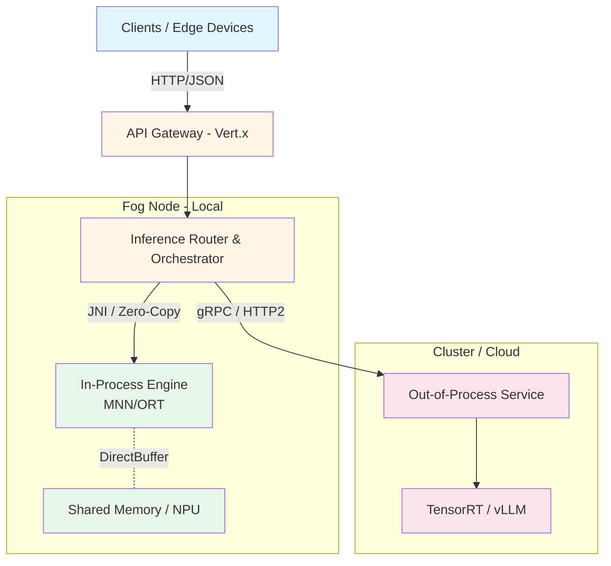
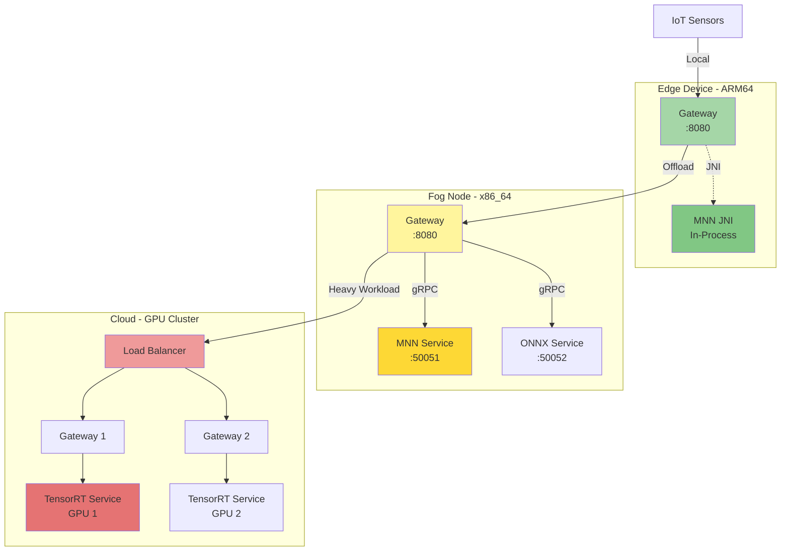
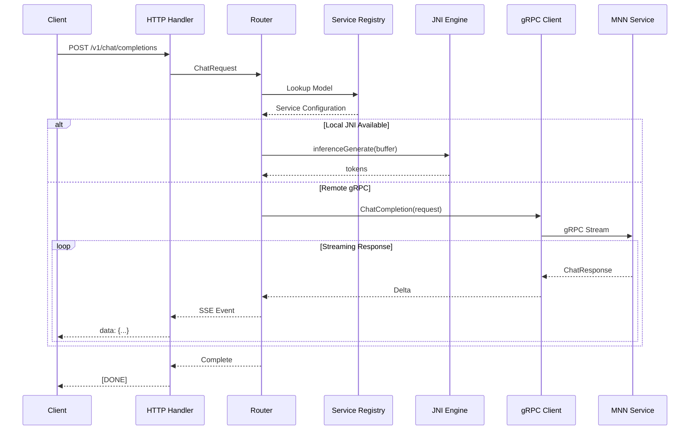
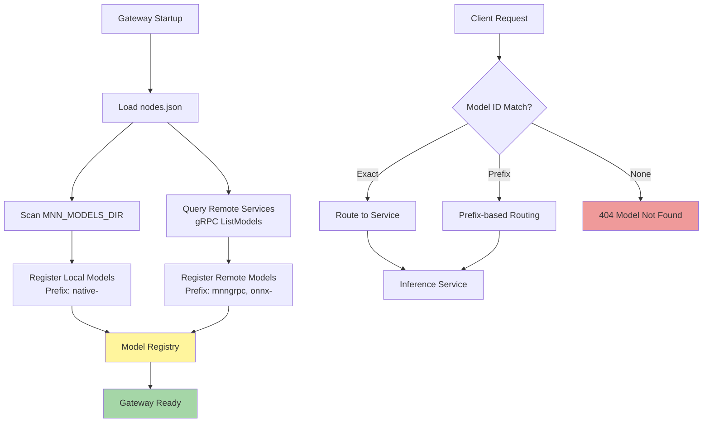

# FogAI Architecture Overview

## 1. Vision & Objectives
**FogAI** is a high-performance, distributed **fog/edge-first platform for AI inference**. It exposes an OpenAI-compatible API while leveraging a heterogeneous multi-engine backend (MNN, ONNX Runtime, TensorRT) to execute models across diverse hardware architectures (ARM64, x86_64, GPU/NPU).

**Key Use Case:** Intelligent Edge / Fog Computing. Real-time processing of data streams (DSA - Decision Support Agents) where low latency, energy efficiency, and optimization for edge hardware are critical.

## 2. Core Architecture
The system follows a hybrid architecture combining high-performance in-process inference with scalable microservices.

## 3. Inference Node Types
FogAI defines two distinct types of inference nodes to balance **real-time performance** and **scalability**:

### Type A: In-Process JNI Nodes
- **Implementation:** Native C++ libraries (MNN/ONNX Runtime) loaded directly into the JVM process (Vert.x).
- **Data Path:** Vert.x off-heap `Buffer` → `nioBuffer()` → `DirectByteBuffer` → JNI → Native Tensor.
- **Latency:** Microsecond-level overhead (~20–50 µs).
- **Zero-Copy:** Data payload is passed by reference (pointer), avoiding intermediate copies.
- **Fail Strategy:** Tight coupling; a crash in native code affects the JVM.
- **Use Case:**
    - **CRITICAL** priority requests (DSA, Sensor Fusion).
    - Strict SLA requirements (0–10 ms).
    - Local Fog co-located models.

### Type B: Out-of-Process gRPC Nodes
- **Implementation:** Standalone C++ services communicating via gRPC (Protobuf).
- **Data Path:** Gateway → Serialization → Network/Localhost → Deserialization → Engine.
- **Latency:** Millisecond-level overhead (3–5 ms).
- **Scalability:** Processes can be scaled independently, distributed across hosts (Edge -> Fog -> Cloud).
- **Isolation:** Service crash does not impact the API Gateway.
- **Use Case:**
    - **Heavier Models** (LLMs > 50MB, GPU inference).
    - **NORMAL / BACKGROUND** priority traffic.
    - Multi-host deployments.

## 4. Routing & Orchestration Strategy
The **Inference Router** acts as the intelligent brain of the node.

### Selection Policy
| Priority | Model Size | Location | Action |
| :--- | :--- | :--- | :--- |
| **CRITICAL** | Small/Med | Local | **Use JNI Node** (Preempt others) |
| **NORMAL** | Any | Local/Remote | **Use gRPC Node** (Load Balance) |
| **BACKGROUND** | Any | Any | **Use Queue** (Process when idle) |

### Real-Time Prioritization (DSA Ready)
Unlike standard FIFO queues, FogAI implements **Multi-Level Priority Queues** with **Earliest Deadline First (EDF)** scheduling:
1.  **CRITICAL Queue:** For low-latency sensor events. Can preempt NORMAL tasks if supported by engine.
2.  **NORMAL Queue:** Standard user interactions (Chat, completions).
3.  **BACKGROUND Queue:** Analytics, batch jobs.

## 5. Technology Stack
- **Backend:** Kotlin / Java 21 (Vert.x) - Non-blocking I/O event loop.
- **Inference Engines:**
    - **MNN (Alibaba):** Primary engine for ARM/Mobile/Edge (CPU/NPU/OpenCL).
    - **ONNX Runtime:** Universal engine for varying hardware.
    - **TensorRT:** High-throughput GPU inference.
- **Interoperability:** JNI / Project Panama (Java 21+) for high-performance native access.
- **Protocol:** gRPC (Internal), HTTP/SSE (External API).
- **Database:** MongoDB (Metadata, Logs, Vector Store).

## 6. Zero-Copy Pipeline
To maximize efficiency on Edge/ARM devices, the data flow minimizes memory copies:

```mermaid
flowchart LR
    subgraph "HTTP Layer"
        A[HTTP Request Body] -->|1| B[Netty Off-Heap Buffer]
    end
    
    subgraph "JNI Bridge"
        B -->|2. nioBuffer| C[DirectByteBuffer]
        C -->|3. GetDirectBufferAddress| D[Native Pointer]
    end
    
    subgraph "Engine Layer"
        D -->|4. Tensor::create| E[MNN Tensor View<br/>Zero-Copy]
        E -->|5. Inference| F[Output Tensor]
        F -->|6. Wrap| G[Output DirectBuffer]
    end
    
    subgraph "Response"
        G -->|7. Netty Buffer| H[HTTP Response]
    end
    
    style B fill:#e8f5e9
    style C fill:#e8f5e9
    style D fill:#e8f5e9
    style E fill:#c8e6c9
    style F fill:#c8e6c9
    style G fill:#e8f5e9
```

**Pipeline Steps:**
1.  HTTP Request body is read into Netty's off-heap memory.
2.  Pointer to this memory is passed via JNI to the Inference Engine.
3.  Engine constructs a Tensor view over this memory (no copy).
4.  Inference runs in-place or writes to a pre-allocated output buffer.
5.  Output buffer is wrapped in a Netty Buffer and sent as HTTP Response.

## 7. Deployment Architecture

## 8. Component Interactions

## 9. Model Discovery & Registration

## 10. Future Roadmap
- **NativeMnnBridge:** Implement the JNI/Panama layer for MNN.
- **Model Registry:** Dynamic discovery and management of models.
- [x] DSA Logic / Priority Queue Implementation in Vert.x
- [ ] TensorRT GPU Support
- **Distributed Tracing:** OpenTelemetry integration for observability.
- **Request Batching:** Optimize throughput for batch inference.
- **Model Warm-up:** Pre-load frequently used models.
- **Adaptive Routing:** ML-based routing decisions based on load and latency.

## 11. Performance Characteristics

| Component | Metric | Target | Actual |
|-----------|--------|--------|--------|
| **JNI Overhead** | Latency | <50µs | 20-50µs |
| **gRPC Overhead** | Latency | <5ms | 3-5ms |
| **Gateway Throughput** | Requests/sec | >1000 | ~800-1200 |
| **MNN Inference** | Tokens/sec | >50 | 40-80 (model dependent) |
| **Memory Footprint** | Gateway | <512MB | ~300MB |
| **Memory Footprint** | MNN Service | <2GB | 500MB-2GB (model dependent) |

## 12. Security Considerations

- **Authentication:** Not implemented (to be added for production).
- **Authorization:** Model-level access control (planned).
- **Rate Limiting:** Request throttling (planned).
- **Input Validation:** Sanitize user inputs to prevent injection attacks.
- **Model Isolation:** Each service runs in isolated process/container.
- **Secure Communication:** TLS for gRPC (recommended for production).
